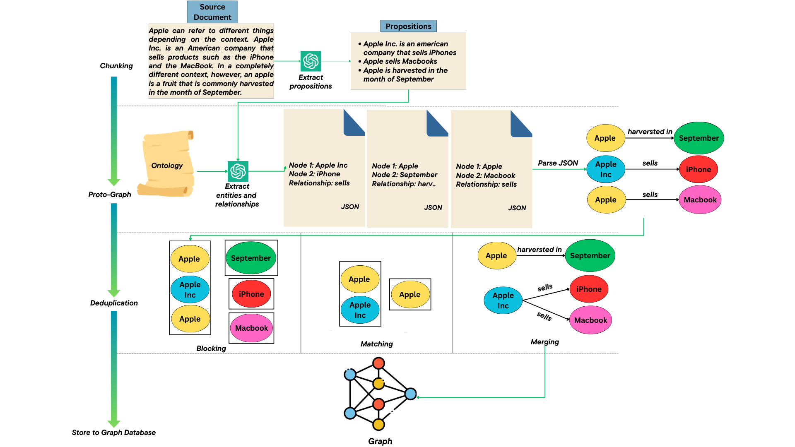
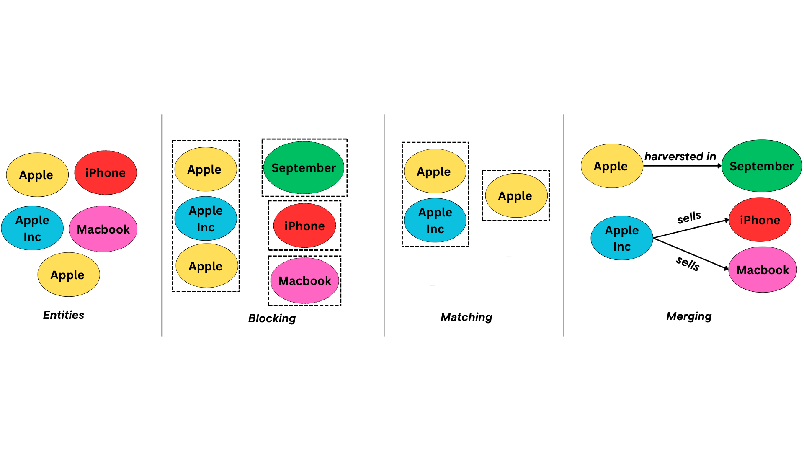

# CypherRAG

**CypherRAG** is a framework for constructing and querying knowledge graphs using large language models.
The system transforms unstructured text into a structured knowledge graph and enables users to query the graph using natural language.

By combining graph databases with LLM-based reasoning, CypherRAG enables more structured, explainable, and context-aware retrieval compared to traditional Retrieval-Augmented Generation (RAG) systems.

---

## Overview

CypherRAG provides a pipeline for:

1. Converting raw text into structured knowledge graph entities and relationships
2. Resolving entity references across documents
3. Storing the graph in Neo4j
4. Generating Cypher queries from natural language questions
5. Executing queries and returning responses

The framework is designed for experimentation with **LLM-driven knowledge graph construction and graph-based question answering**.

---

## Features

* Knowledge graph construction from unstructured text
* Entity resolution across documents
* Natural language to Cypher query generation
* Graph-based question answering
* Modular architecture for experimentation

---

## Tech Stack

**Graph Database:**  
- Neo4j  

**LLM Framework:**  
- LangChain  

**Language Models:**  
- OpenAI API  
- Ollama  

**Programming Language:**  
- Python  

**Dependency Management:**  
- Poetry  


---

## System Architecture

CypherRAG consists of two main stages:

### 1. Knowledge Graph Construction

Raw documents are processed and transformed into structured entities and relationships.
Entity resolution is applied to merge references to the same entity across passages.

### 2. Graph Querying

Natural language questions are converted into Cypher queries using an LLM.
These queries are executed against the graph database to retrieve relevant information.







---

## Project Structure

```
CypherRAG
│
├── data
|
├── docs
├── evaluation_scripts
|
├── experiments
│   ├── notebooks
│   ├── results
|
├── logs
├── notes
|
├── src
│   ├── knowledge_graph_maker
│   ├── ER.py
│   ├── generate_graph.py
│   ├── main.py
│   └── query_graph.py
│
├── poetry.lock
├── pyproject.toml
└── README.md
```

**Key Modules:**

- **knowledge_graph_maker** – Builds entities and relationships from raw text  
- **ER.py** – Handles entity resolution  
- **generate_graph.py** – Generates and populates the knowledge graph  
- **query_graph.py** – Converts queries into Cypher and executes them  
- **main.py** – Entry point for running the full pipeline via Streamlit 

---

## Installation

### 1. Clone the repository:

```bash
git clone https://github.com/your-username/CypherRAG.git
cd CypherRAG
```

### 2. Create a Conda environment
```bash
# Create a new conda environment (Python 3.11 example)
conda create -n cypherrag python=3.11 -y

# Activate the environment
conda activate cypherrag
```

### 3. Install dependencies using Poetry:
```bash
# Install Poetry if not already installed
pip install --user poetry

# Install project dependencies
poetry install
```

### 4. Set up Neo4j
1. Install Neo4j (Desktop or Server version).
2. Create a new database instance.
3. Make sure the Neo4j instance is running and accessible.
4. Update connection credentials in your project configuration (e.g., .env or config file) if required.

---

## Usage

Run the Streamlit application:

```bash
streamlit run src/main.py
```

The application will launch in your browser.
You can interactively query the knowledge graph using natural language.


Example query:

```
Who is the Dark Lord in Middle-earth?
```

Example generated Cypher query:

```
MATCH (c:Character)-[:HAS_TITLE]->(t:Title {name:"Dark Lord"})
RETURN c.name
```

---

## Evaluation
Scripts for evaluating model performance and graph quality are included in `evaluation_scripts/`.

Results from experiments and notebooks can be found in `experiments/results/` and `experiments/notebooks/`.

---
## Future Improvements
- Enhance entity resolution accuracy
- Support larger document collections
- Add evaluation metrics for query and response accuracy
- Improve prompt engineering for Cypher generation
- Add visualization tools for the knowledge graph

---

## Author


Elizer Ponio Jr.

Researcher focusing on knowledge graphs, LLM pipelines, and graph-based question answering.

---

## License

MIT License
